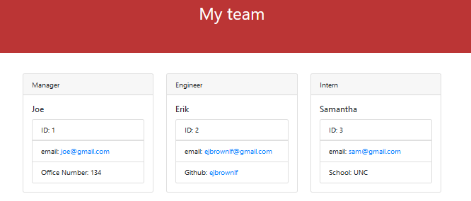

# Team Profile Generator

## Description 

This application will ask you some questions about the professional team you are building and create a stylized html page displaying each member and the information about them that was inputed by the user

## Table of Contents

* [Installation](#installation)
* [Usage](#usage)
* [License](#license)
* [Questions](#questions)
* [Tests](#tests)

## Installation

* Make sure you install node.js, it can be downloaded [here](https://nodejs.org/en/)
* Open your terminal using something like git bash or the built in terminal in VS Code
* Navigate to the directory in which you installed this application with your terminal
* Next type `npm install`
* Finally type `node index.js` to start the application

## Usage 

To use this app, answer the questions that are prompted in the command line.
You wil first be asked questions about your team manager. Once that is done you will be asked to add more team members.

You can either add an engineer or an intern to your team or you can end the application.

The information inputed will be saved for each user that is created.

Information you will be asked for each type of team member:
* Manager
    * Name, Email, and Office Number
* Engineer:
    * Name, Email, and Github username
* Intern
    * Name, Email, and School they go to

Here is a video demonstration on how to use this application (click the image to go to the video): 

Here is an example image of an html page created using this app

---

# License

This project is covered by the [MIT](https://opensource.org/licenses/MIT) License

# Questions

Here is a link to my [Github](https://github.com/ejbrownlf)

You can reach me by emailing me here at ejbrownlf@gmail.com

# Tests

Run the command `npm test` to make sure all functions work properly

